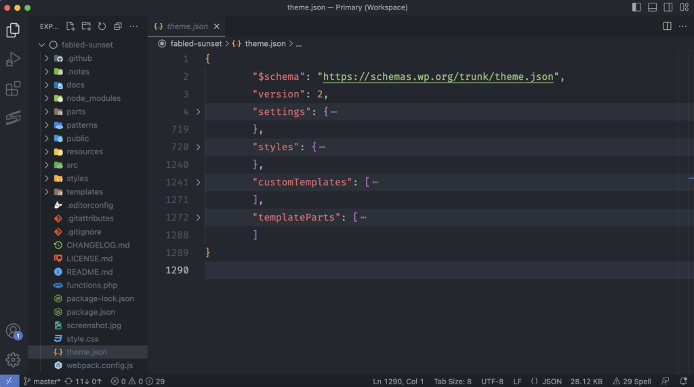

# Theme Structure

In the Getting Started chapter, you learned the basics of what a theme is and how to get one up and running without code. A no-code approach is perfectly OK for simple themes, but once you want to add things that are not possible in the user interface, you’ll need to start working directly with code.

It’s a good idea to familiarize yourself with what others are doing

### Files and folders

WordPress themes are nothing more than a collection of various files that rely on different web technologies, such as HTML, CSS, and PHP. Block themes also follow a standard structure in how many of those files are laid out.

Take note of the files/folders marked required because they are necessary for a block theme to work:

##### Required files

- **style.css (Main Stylesheet)**: This file is required for configuring theme data, such as its name and description. It can also be used for adding custom CSS.
- **templates/index.html (Templates)**: The default/fallback template. This is necessary for WordPress to consider this a block theme.

##### Optional files

A theme can include any number of custom files other than the required list above. WordPress also looks for a few other files and uses them if they are available:

- **README.txt (Theme Review: Files)**: This is not used directly by the WordPress software. But it is a required file when submitting a theme to the official WordPress theme directory, meant to provide information about the theme to users.
- **functions.php (Custom Functionality)**: A PHP file that WordPress automatically loads after the theme is initialized during the page-loading process. You can use it to run custom PHP.
- **screenshot.png**: A 1200×900 screenshot image of your theme. 
- **theme.json (Global Settings and Styles)**: Used to configure settings and styles for the site, integrating with the user interface.

### Standard folders

In the example above, there were a few folders included. A theme can have many more folders, but WordPress has designated a few of them for specific features. You will learn more about these folders as you read through this chapter:

- **parts (Template Parts)**: Houses custom template parts for your theme. Parts are smaller sections that you can include within top-level templates. Often, this will include things like headers, footers, and sidebars.
- **patterns (Block Patterns)**: Reusable patterns made up of one or more blocks that users can insert via the editor interface. WordPress will automatically register files included in this folder.
- **styles (Style Variations)**: Variations on the theme's global settings and styles stored in individual JSON files.
- **templates (Templates)**: Files that represent the overall document structure of the front-end. Templates are made up of block markup and are what site visitors see.

### Advanced theme structure

 These files are entirely optional and will differ from theme to theme.

In reality, block themes can contain many more files and folders. The more complex the project becomes, the more complex its structure will be.

#### Optional folders

There is no limit on what folders may be included, but the above example added two of the most common use cases you'll come across in WordPress themes:

- **assets (Including Assets)**: Many theme authors use this folder to store additional CSS, Images/Media, and JavaScript needed for their theme. This folder may also have other names, such as resources or public.
- **inc (Custom Functionality)**: Themes will often have custom PHP classes or files stored in this folder for additional functionality. This folder may also be seen named as includes, src, and more.

### Optional files

This list is nowhere near exhaustive, but it includes some common files used in theme development. (Note: most of the following links lead to external, third-party sites and are not affiliated with WordPress.)

- **.editorconfig (EditorConfig)**: Used for configuring formatting, such as line endings and spacing, for code editors.
- **.gitattributes (Git: Attributes)**: Configures attributes with the Git version control system.
- **.gitignore (Git: Ignore)**: Defines files to ignore when committing code to a Git repository.
- **CHANGELOG.md (Keep a Changelog)**: A human-readable log of important changes for each release of your theme.
- **LICENSE.md (Theme Review: Licensing & Copyright)**: Defines the license for the theme. Note that all themes submitted to the WordPress theme directory must be licensed under the GPL v2+.
- **package.json (npm: package.json)**: Often used to define a build process and development dependencies within a Node environment.****

## Code editor view

even when building block themes following standard practices, you will have a lot of freedom to customize things. You may want to integrate with version control systems, add in a build process, and more.

